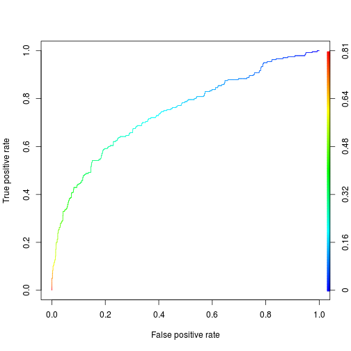
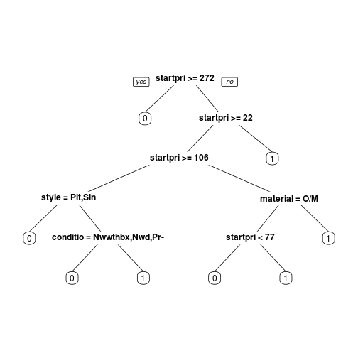
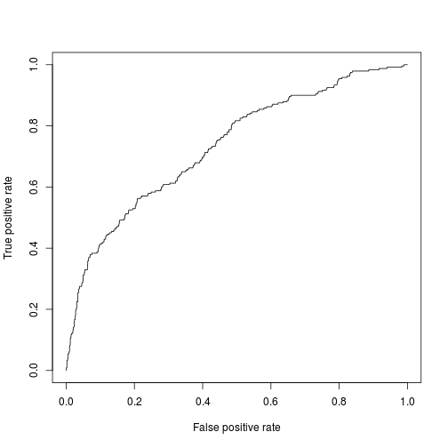
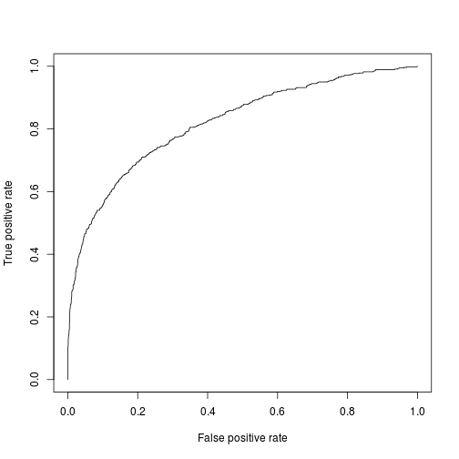

#   Predicting Ebay Sales
###  Reproducible notes for Predicting Ebay Sales

#            Anil Kumar  IIT Madras


## [[source files available on GitHub](https://github.com/anilcs13m)]]
## [[connect on linkedin]](https://in.linkedin.com/in/anilcs13m)]]


#  PRELIMINARIES

Load the library that are required in the assignment:

```r
library("tm")
library("SnowballC")

library("caTools")
library("rpart")
library("rpart.plot")
library("ROCR")
library("randomForest")
library("e1071")
```

# PREDICTING SALES ON EBAY

Individuals selling used items are often faced with a difficult choice -- should they try to sell the items through 
a yard/estate sale, a consignment shop, an auction, or some other means? Often, this choice will come down to the convenience 
of selling the items, the price the items can fetch, and the speed with which the items can be sold.

To determine whether analytics can be used to help make this choice, we will look at whether data from previous auctions on eBay,
a major online auction and shopping site, can be used to predict whether a new item will be sold at some target price.
We will limit our attention to Christian Louboutin shoes, using data from nearly 4,000 auctions from late 2014.
In this analysis, the dependent variable will be the binary outcome variable sold, which takes value 1 if the item was sold and 0 
if it was not sold. We also include saleprice, which is the price the shoe sold at (NA for shoes that did not sell).
For each item, the file ebay.csv contains the following independent variables:
## Variables 

* biddable: Whether this is an auction (biddable=1) or a sale with a fixed price (biddable=0)
* startprice: The start price (in US Dollars) for the auction (if biddable=1) or the sale price (if biddable=0)
* condition: The condition of the shoe (New with box, New with defects, New without box, or Pre-owned)
* size: The size of the shoe (converted to US shoe sizes)
* heel: The size of the heel (Flat, Low, Medium, High)
* style: The style of the shoe (Open Toe, Platform, Pump, Slingback, Stiletto, or Other/Missing)
* color: The color of the shoe (Beige, Black, Brown, Red, or Other/Missing)
* material: The material of the shoe (Leather, Patent Leather, Satin, Snakeskin, Suede, or Other/Missing)
* snippit: A short snippit of text describing the shoe
* description: A long text description describing the shoe


### Using __Text__ as data  

Using data as a data is a difficult task, as text data is not structured as accoring to the requirement and not well written, use of the symbol and other symbolic representation make text analytics more difficult. so handling text data is a challenging problem.
So for this field is called Natural Language Processing comes, goal of NLP is to understand and derive meaning from
human language in a meaning full way so that machine can understand.


### Preprocessing of data

Text data often has many inconsistencies that will cause algorithms trouble
like: Apple, apple and aPple in the text data should we consider as a single word, not multiple words as text data is releted with the apple company only. So for this we diffirent preprocessing techniq to over come such problems, related to the text data.

Here are some of the following steps that we will cover presentation:

 * change all the words in words in lower or upper
 * remove punctuation
 * remove stop words
 * stemming


## LOADING AND PROCESSING DATA

We can see what proportion of sold is these by usign the table command


```r
eBay <- read.csv("ebay.csv", stringsAsFactors = FALSE)
table(eBay$sold)
```

```
## 
##    0    1 
## 2997  799
```
__Note__: when working on a text data we add `stringsAsFactors = FALSE`, as an argument.

Explore the structure of our data: 


```r
str(eBay)
```

```
## 'data.frame':	3796 obs. of  12 variables:
##  $ biddable   : int  1 0 1 1 0 1 1 1 0 1 ...
##  $ sold       : int  0 0 1 1 0 1 1 0 1 1 ...
##  $ startprice : num  199 375 300 50 89 ...
##  $ saleprice  : num  NA NA 780 561 NA ...
##  $ condition  : chr  "Pre-owned" "New with box" "Pre-owned" "Pre-owned" ...
##  $ size       : num  9.5 7.5 8.5 8.5 5.5 8.5 10 6.5 9 6.5 ...
##  $ heel       : chr  "Low" "High" "High" "High" ...
##  $ style      : chr  "Open Toe" "Slingback" "Pump" "Pump" ...
##  $ color      : chr  "Black" "Other/Missing" "Black" "Black" ...
##  $ material   : chr  "Suede" "Satin" "Other/Missing" "Snakeskin" ...
##  $ snippit    : chr  "Had soles re- covered." "" "" "" ...
##  $ description: chr  "Very good condition. Heel height very manageable. Low black" "From my own personal collection, great condition, and only tried on for 5 minutes around the house. They are size 37.5 but fit "| __truncated__ "With its staggering half-foot-high heel and chunky hidden platform, the Christian Louboutin Daffodile pump exemplifies the line"| __truncated__ "Comes w/ box, dustbag, and extra heel in its own dustbag!  Designer: Christian Louboutin Material: Water Snake &amp; Leather Or"| __truncated__ ...
```

We have __3796__ observations of __12__ variables:

For Finding any missing values in the variables we can use __summary__ function from __R__:

```r
summary(eBay)
```

```
##     biddable           sold          startprice       saleprice     
##  Min.   :0.0000   Min.   :0.0000   Min.   :   0.0   Min.   :   0.0  
##  1st Qu.:0.0000   1st Qu.:0.0000   1st Qu.: 280.0   1st Qu.: 200.0  
##  Median :1.0000   Median :0.0000   Median : 449.0   Median : 325.0  
##  Mean   :0.5911   Mean   :0.2105   Mean   : 472.3   Mean   : 372.7  
##  3rd Qu.:1.0000   3rd Qu.:0.0000   3rd Qu.: 600.0   3rd Qu.: 500.0  
##  Max.   :1.0000   Max.   :1.0000   Max.   :4500.0   Max.   :3995.0  
##                                                     NA's   :2997    
##   condition              size            heel              style          
##  Length:3796        Min.   : 4.000   Length:3796        Length:3796       
##  Class :character   1st Qu.: 7.000   Class :character   Class :character  
##  Mode  :character   Median : 8.000   Mode  :character   Mode  :character  
##                     Mean   : 7.933                                        
##                     3rd Qu.: 9.000                                        
##                     Max.   :12.000                                        
##                     NA's   :68                                            
##     color             material           snippit         
##  Length:3796        Length:3796        Length:3796       
##  Class :character   Class :character   Class :character  
##  Mode  :character   Mode  :character   Mode  :character  
##                                                          
##                                                          
##                                                          
##                                                          
##  description       
##  Length:3796       
##  Class :character  
##  Mode  :character  
##                    
##                    
##                    
## 
```
what is the most common shoe size in the dataset, this can be done by using the sort of the table of size 

```r
sort(table(eBay$size))
```

```
## 
##    4   12 11.5  4.5   11    5 10.5  5.5   10    6  9.5  6.5  8.5    9    7 
##   14   14   21   28   79   87  139  154  235  264  298  356  385  397  402 
##  7.5    8 
##  413  442
```
# CONVERTING VARIABLES TO FACTORS
We are converting variables to factor variables, as some of the model required dependent variable to be factor variable like random forest requires for classification.


```r
eBay$sold = as.factor(eBay$sold)
eBay$condition = as.factor(eBay$condition)
eBay$heel = as.factor(eBay$heel)
eBay$style = as.factor(eBay$style)
eBay$color = as.factor(eBay$color)
eBay$material = as.factor(eBay$material)
```

Now Let's build model by using using __eBay__ dataframe, but before building this model we need to split data into training 
and testing set, this can be done by using the __sample.split__ function in __R__.
In this spliting we are using 70% of the data as the training data and rest of data as the test data.


```r
set.seed(144)
spl = sample.split(eBay$sold, 0.7)
```
# Train and Test Data

```r
training = subset(eBay, spl==TRUE)
testing = subset(eBay, spl==FALSE)
```
# Build Model
We are building logistic regression model using independent variables "biddable", "startprice", "condition", "heel", "style", "color",
and "material", using the training set to obtain the model:

logistic regression model set family as binomial:

```r
model = glm(sold ~ biddable+startprice+condition+heel+style+color+material, data=training, family="binomial")
summary(model)
```

```
## 
## Call:
## glm(formula = sold ~ biddable + startprice + condition + heel + 
##     style + color + material, family = "binomial", data = training)
## 
## Deviance Residuals: 
##     Min       1Q   Median       3Q      Max  
## -1.5805  -0.7022  -0.5002  -0.2166   5.9322  
## 
## Coefficients:
##                             Estimate Std. Error z value Pr(>|z|)    
## (Intercept)                0.5990788  0.3285428   1.823 0.068236 .  
## biddable                   0.0113984  0.1114610   0.102 0.918547    
## startprice                -0.0044423  0.0003041 -14.607  < 2e-16 ***
## conditionNew with defects -0.2451855  0.3727966  -0.658 0.510736    
## conditionNew without box  -0.2145965  0.2290351  -0.937 0.348780    
## conditionPre-owned        -0.4952981  0.1374505  -3.603 0.000314 ***
## heelFlat                   0.1431346  0.6387994   0.224 0.822704    
## heelHigh                   0.1224260  0.1340119   0.914 0.360955    
## heelLow                   -2.5549302  1.0411255  -2.454 0.014127 *  
## heelMedium                -0.5830418  0.2674958  -2.180 0.029285 *  
## styleOther/Missing         0.5268920  0.2127852   2.476 0.013280 *  
## stylePlatform             -0.1712048  0.2102085  -0.814 0.415386    
## stylePump                  0.4683107  0.1817995   2.576 0.009996 ** 
## styleSlingback            -0.2294999  0.2535765  -0.905 0.365438    
## styleStiletto              0.8325406  0.2606786   3.194 0.001404 ** 
## colorBlack                 0.2226547  0.1766847   1.260 0.207604    
## colorBrown                -0.5252811  0.2982060  -1.761 0.078159 .  
## colorOther/Missing        -0.2051389  0.1793759  -1.144 0.252779    
## colorRed                  -0.1261035  0.2705234  -0.466 0.641111    
## materialOther/Missing     -0.2192565  0.1531385  -1.432 0.152214    
## materialPatent Leather     0.0809572  0.1431549   0.566 0.571719    
## materialSatin             -1.1078098  0.3153264  -3.513 0.000443 ***
## materialSnakeskin          0.1562727  0.3444677   0.454 0.650070    
## materialSuede             -0.0713244  0.1789439  -0.399 0.690199    
## ---
## Signif. codes:  0 '***' 0.001 '**' 0.01 '*' 0.05 '.' 0.1 ' ' 1
## 
## (Dispersion parameter for binomial family taken to be 1)
## 
##     Null deviance: 2733.9  on 2656  degrees of freedom
## Residual deviance: 2372.7  on 2633  degrees of freedom
## AIC: 2420.7
## 
## Number of Fisher Scoring iterations: 5
```
# prediction 
For prediction we use the command __predict__, probability threshold of 0.5,


```r
pred = predict(model, newdata = testing, type = "response")
table(pred >= 0.5)
```

```
## 
## FALSE  TRUE 
##  1059    80
```

```r
table(testing$sold,pred>=0.5)
```

```
##    
##     FALSE TRUE
##   0   877   22
##   1   182   58
```

```r
table(testing$sold)
```

```
## 
##   0   1 
## 899 240
```
# COMPUTING TEST-SET AUC

```r
ROCRpred = prediction(pred,testing$sold)
as.numeric(performance(ROCRpred,"auc")@y.values)
```

```
## [1] 0.7444244
```
# PLOT ROC
Plotting the ROC curve for the model's performance 

```r
ROCRperf = performance(ROCRpred,"tpr","fpr")
plot(ROCRperf,colorize=TRUE)
```

 
# CROSS-VALIDATION TO SELECT PARAMETERS
### TRAIN CART MODEL


```r
set.seed(144)
numFolds = trainControl(method="cv",number=10)
cpGrid = expand.grid(.cp=seq(0.001,0.05,0.001))
train(sold~biddable+startprice+condition+ heel+ style+ color+material ,data=training,method="rpart",trControl=numFolds,tuneGrid=cpGrid)
```

```
## CART 
## 
## 2657 samples
##   11 predictors
##    2 classes: '0', '1' 
## 
## No pre-processing
## Resampling: Cross-Validated (10 fold) 
## Summary of sample sizes: 2391, 2391, 2392, 2391, 2392, 2391, ... 
## Resampling results across tuning parameters:
## 
##   cp     Accuracy   Kappa      Accuracy SD  Kappa SD  
##   0.001  0.8091928  0.3009632  0.025965542  0.10279441
##   0.002  0.8106994  0.2830072  0.021504296  0.08698237
##   0.003  0.8152135  0.2785765  0.022484082  0.09425898
##   0.004  0.8148291  0.2777788  0.023007816  0.10510122
##   0.005  0.8174606  0.2792412  0.021719248  0.10717739
##   0.006  0.8170833  0.2756554  0.023126922  0.11405847
##   0.007  0.8163314  0.2705521  0.022331590  0.10935238
##   0.008  0.8163314  0.2707547  0.021544196  0.10553452
##   0.009  0.8163314  0.2707547  0.021544196  0.10553452
##   0.010  0.8167073  0.2674603  0.021927526  0.10898871
##   0.011  0.8152022  0.2602950  0.023073901  0.10434024
##   0.012  0.8140743  0.2590317  0.023316362  0.10430422
##   0.013  0.8148262  0.2592311  0.022682228  0.10416590
##   0.014  0.8140729  0.2676487  0.023127717  0.09776566
##   0.015  0.8140729  0.2676487  0.023127717  0.09776566
##   0.016  0.8140729  0.2676487  0.023127717  0.09776566
##   0.017  0.8140729  0.2676487  0.023127717  0.09776566
##   0.018  0.8140729  0.2676487  0.023127717  0.09776566
##   0.019  0.8140729  0.2676487  0.023127717  0.09776566
##   0.020  0.8140729  0.2676487  0.023127717  0.09776566
##   0.021  0.8140729  0.2676487  0.023127717  0.09776566
##   0.022  0.8140729  0.2676487  0.023127717  0.09776566
##   0.023  0.8140729  0.2676487  0.023127717  0.09776566
##   0.024  0.8140729  0.2676487  0.023127717  0.09776566
##   0.025  0.8121932  0.2511626  0.022012193  0.09643119
##   0.026  0.8125692  0.2531311  0.022394577  0.09886132
##   0.027  0.8125692  0.2531311  0.022394577  0.09886132
##   0.028  0.8076720  0.2147947  0.016193693  0.06488761
##   0.029  0.8076720  0.2147947  0.016193693  0.06488761
##   0.030  0.8057923  0.1998072  0.013016926  0.04098977
##   0.031  0.8057923  0.1998072  0.013016926  0.04098977
##   0.032  0.8057923  0.1998072  0.013016926  0.04098977
##   0.033  0.8057923  0.1998072  0.013016926  0.04098977
##   0.034  0.8057923  0.1998072  0.013016926  0.04098977
##   0.035  0.8057923  0.1998072  0.013016926  0.04098977
##   0.036  0.8057923  0.1998072  0.013016926  0.04098977
##   0.037  0.8057923  0.1998072  0.013016926  0.04098977
##   0.038  0.8057923  0.1998072  0.013016926  0.04098977
##   0.039  0.8057923  0.1998072  0.013016926  0.04098977
##   0.040  0.8057923  0.1998072  0.013016926  0.04098977
##   0.041  0.8057923  0.1998072  0.013016926  0.04098977
##   0.042  0.8057923  0.1998072  0.013016926  0.04098977
##   0.043  0.8057923  0.1998072  0.013016926  0.04098977
##   0.044  0.8057923  0.1998072  0.013016926  0.04098977
##   0.045  0.8057923  0.1998072  0.013016926  0.04098977
##   0.046  0.8020187  0.1742727  0.011785686  0.07105536
##   0.047  0.8020187  0.1742727  0.011785686  0.07105536
##   0.048  0.7990112  0.1534393  0.010592145  0.08838699
##   0.049  0.7963796  0.1350344  0.009128368  0.09973832
##   0.050  0.7941240  0.1191052  0.007467116  0.10782603
## 
## Accuracy was used to select the optimal model using  the largest value.
## The final value used for the model was cp = 0.005.
```

```r
cart = rpart(sold~biddable+startprice+condition+ heel+ style+ color+material ,data=training,method="class",cp=0.006)
prp(cart)
```

 


## CREATING A CORPUS

One of fundamental concepts in text analysis, implemented in the package `tm` as well, 
is that of a __corpus__.    
A __corpus is a collection of documents__.

We will need to convert our text to a corpus for pre-processing. 
Various function in the `tm` package can be used to create a corpus in many different ways.    


```r
corpus=Corpus(VectorSource(eBay$description))
```

Let's check out our corpus:

```r
corpus
```

```
## <<VCorpus>>
## Metadata:  corpus specific: 0, document level (indexed): 0
## Content:  documents: 3796
```

### Pre-processing steps 
   
To deal with text data following pre-processing is required. 

Follow the standard steps to build and pre-process the corpus:

	1) Build a new corpus variable called corpus.

	2) Using tm_map, convert the text to lowercase.

	3) Using tm_map, remove all punctuation from the corpus.

	4) Using tm_map, remove all English stopwords from the corpus.

	5) Using tm_map, stem the words in the corpus.

	6) Build a document term matrix from the corpus, called dtm.

Each operation, like stemming or removing stop words, can be done with one line in R,  
where we use the `tm_map()` function which takes as

* its first argument the name of a __corpus__ and 
* as second argument a __function performing the transformation__ that we want to apply to the text.

First step is to transform all text _to lower case_:


```r
corpus <- tm_map(corpus, tolower)
```

After performing the first step we can check the same "documents" as before:
and we can see that there is no word present in the tweet having upper case character:


```r
corpus[[1]]
```

```
## [1] "very good condition. heel height very manageable. low black"
```
### Plain Text Document

converts corpus to a Plain Text Document


```r
corpus <- tm_map(corpus, PlainTextDocument)
```

### Removing punctuation


```r
corpus <- tm_map(corpus, removePunctuation)
```
### Stop Words

Look at stop words 

```r
stopwords("english")[1:10]
```

```
##  [1] "i"         "me"        "my"        "myself"    "we"       
##  [6] "our"       "ours"      "ourselves" "you"       "your"
```
Stop words are the words that having no meaning or very less meaning in the corpus, 
so we remove those words which caring less meaning for our corpus


Removing words can be done with the `removeWords` argument to the `tm_map()` function, with an
extra argument, _i.e._ what the stop words are that we want to remove.  


```r
corpus <- tm_map(corpus, removeWords, stopwords("english"))
```

Now check out our corpus

```r
corpus[[1]]
```

```
## <<PlainTextDocument>>
## Metadata:  7
## Content:  chars: 49
```

### Stemming

Lastly, we want to stem our document with the `stemDocument` argument.


```r
corpus <- tm_map(corpus, stemDocument)
```


```r
corpus[[1]]
```

```
## <<PlainTextDocument>>
## Metadata:  7
## Content:  chars: 41
```
## BAG OF WORDS IN R

### Create a _Document Term Matrix_

We are now ready to extract the __word frequencies__ to be used in our prediction problem.
The `tm` package provides a function called `DocumentTermMatrix()` that generates a __matrix__ where:

* the __rows__ correspond to __documents__, in our case , and 
* the __columns__ correspond to __words__ .

The values in the matrix are the number of times that word appears in each document.


```r
DTM <- DocumentTermMatrix(corpus)
```


```r
DTM
```

```
## <<DocumentTermMatrix (documents: 3796, terms: 10599)>>
## Non-/sparse entries: 256771/39977033
## Sparsity           : 99%
## Maximal term length: 1651
## Weighting          : term frequency (tf)
```

We see that in the corpus there are __10599__ __unique words__.

Let's see what this matrix looks like using the `inspect()` function, in particular
slicing a block of rows/columns from the _Document Term Matrix_ by calling by their indices:

```r
inspect(DTM[1:10, 1:10])
```

```
## <<DocumentTermMatrix (documents: 10, terms: 10)>>
## Non-/sparse entries: 0/100
## Sparsity           : 100%
## Maximal term length: 7
## Weighting          : term frequency (tf)
## 
##               Terms
## Docs           \U0001f460\U0001f460\U0001f460 000 00001pt 001 001p 002 010
##   character(0)                              0   0       0   0    0   0   0
##   character(0)                              0   0       0   0    0   0   0
##   character(0)                              0   0       0   0    0   0   0
##   character(0)                              0   0       0   0    0   0   0
##   character(0)                              0   0       0   0    0   0   0
##   character(0)                              0   0       0   0    0   0   0
##   character(0)                              0   0       0   0    0   0   0
##   character(0)                              0   0       0   0    0   0   0
##   character(0)                              0   0       0   0    0   0   0
##   character(0)                              0   0       0   0    0   0   0
##               Terms
## Docs           012 013632 015117
##   character(0)   0      0      0
##   character(0)   0      0      0
##   character(0)   0      0      0
##   character(0)   0      0      0
##   character(0)   0      0      0
##   character(0)   0      0      0
##   character(0)   0      0      0
##   character(0)   0      0      0
##   character(0)   0      0      0
##   character(0)   0      0      0
```
## inspect __DTM__

```r
#inspect(DTM)
```


### Remove sparse terms

Therefore let's remove some terms that don't appear very often. 

```r
sparse_DTM <- removeSparseTerms(DTM, 0.9)
```
This function takes a second parameters, the __sparsity threshold__.
The sparsity threshold works as follows.

* If we say 0.98, this means to only keep terms that appear in 2% or more .
* If we say 0.99, that means to only keep terms that appear in 1% or more .
* If we say 0.995, that means to only keep terms that appear in 0.5% or more, 
 

Let's see what the new _Document Term Matrix_ properties look like:

```r
sparse_DTM
```

```
## <<DocumentTermMatrix (documents: 3796, terms: 145)>>
## Non-/sparse entries: 121706/428714
## Sparsity           : 78%
## Maximal term length: 9
## Weighting          : term frequency (tf)
```
It only contains __145__ unique terms, _i.e._ only about 
__1.4%__ of the full set.


### Convert the DTM to a data frame

Now let's convert the sparse matrix into a data frame that we will be able to use for our
predictive models.

```r
eBaySparse <- as.data.frame(as.matrix(sparse_DTM))
```
## Summary

```r
summary(colSums(eBaySparse))
```

```
##    Min. 1st Qu.  Median    Mean 3rd Qu.    Max. 
##     403     737    1003    1456    1578    8356
```
### Fix variables names in the data frame

To make all variable names _R-friendly_ use:

```r
names(eBaySparse) <- paste0("D",colnames(eBaySparse))
```


## Add the _dependent_ variable


```r
eBaySparse$sold <- eBay$sold
eBaySparse$biddable <- eBay$biddable
eBaySparse$startprice <- eBay$startprice
eBaySparse$condition <- eBay$condition
eBaySparse$heel <- eBay$heel
eBaySparse$style <- eBay$style
eBaySparse$color <- eBay$color
eBaySparse$material <- eBay$material
```

# BUILDING MACHINE LEARNING MODEL
Before Building the machine learning model, we need to split our data in training and training dataset

### Split data in training/testing sets

Let's split our data into a training set and a testing set


```r
trainText <- subset(eBaySparse, spl == TRUE)
testText <- subset(eBaySparse, spl == FALSE)
```
# TRAINING LOGISTIC REGRESSION MODEL

```r
glmText <- glm(sold~., data = trainText, family = binomial)
glmText_pred <- predict(glmText, newdata = testText, type = "response")
```
# EVALUATE


```r
predROCR <- prediction(predictions = glmText_pred, labels = testText$sold)
perf = performance(predROCR,"tpr","fpr")
plot(perf)
```

 

```r
as.numeric(performance(predROCR, "auc")@y.values)
```

```
## [1] 0.7335743
```
# ON TRAINING SET


```r
glmText_train <- predict(glmText, type = "response")
predROCR1 <- prediction(predictions = glmText_train, labels = trainText$sold)
perf = performance(predROCR1,"tpr","fpr")
plot(perf)
```

 

```r
as.numeric(performance(predROCR1, "auc")@y.values)
```

```
## [1] 0.8195031
```
